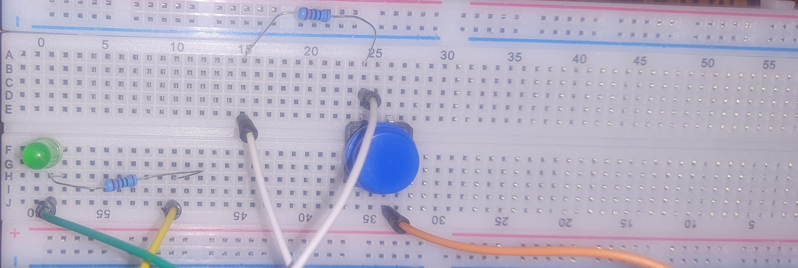

  
  <h1>Iot Projects</h1>
  
A collection of arduino projects

## Table of Content

| Nr.Crt | Project Name                                                                    | Difficulty | Category    | Date       |
| ------ | ------------------------------------------------------------------------------- | ---------- | ----------- | ---------- |
| 1      | [Led Button](https://github.com/BaluIT-ist/IoT-Projects/tree/main/Led%20Button) | Easy       | IoT Starter | 03.10.2024 |
| 2      | [Water Sensor Testing](https://github.com/BaluIT-ist/Microcontrollers/tree/main/ARDUINO/SensorsBasics/WaterSensor/watersensor)                                                               | Easy       | IoT Starter | 27.10.2025 |
| 2      | [90 Degrees button actioned servo rotation](https://github.com/BaluIT-ist/Microcontrollers/blob/main/ARDUINO/SensorsBasics/ServoActionedByButton/ServoButton.png)| Easy       | IoT Starter | 27.10.2025  |
| 2      | TO BE CONTINUED                                                                     | Easy       | IoT Starter | 03.10.2024 |
| 2      | TO BE CONTINUED                                                                     | Easy       | IoT Starter | 03.10.2024 |
| 2      | TO BE CONTINUED                                                                  | Easy       | IoT Starter | 03.10.2024 |

